# RIFT 2026

**Autonomous Self-Healing CI/CD Pipeline**

[](https://rift26-one.vercel.app/)
[](https://www.linkedin.com/posts/purvesh-didpaye-05b723345_rift2026-hackathon-ai-ugcPost-7430439869786755072-0yq9?utm_source=share&utm_medium=member_android&rcm=ACoAAFZtGocBtZQO4BlNgkBzcVnDZVnJdFQomQw)

## 🚀 Deployment

- **Frontend**: [Vercel](https://rift26-one.vercel.app/)
- **Backend**: Render

## 🏗️ Architecture Diagram

```mermaid
graph TD
    %% Styles
    classDef user fill:#f9f,stroke:#333,stroke-width:2px,color:black,font-weight:bold
    classDef frontend fill:#d4f1f9,stroke:#00bfff,stroke-width:2px,color:black,font-weight:bold
    classDef backend fill:#e6fffa,stroke:#00fa9a,stroke-width:2px,color:black,font-weight:bold
    classDef agent fill:#fff3e0,stroke:#ff8c00,stroke-width:2px,color:black
    classDef loop fill:#fff0f5,stroke:#ff69b4,stroke-width:2px,color:black,stroke-dasharray: 5 5
    classDef storage fill:#f3e5f5,stroke:#9370db,stroke-width:2px,color:black

    User([👤 User]):::user -->|1. Submit Repo URL| Frontend[🖥️ React Frontend]:::frontend
    Frontend -->|2. POST /api/run| Backend[⚙️ FastAPI Backend]:::backend

    subgraph Core_Logic [Backend Execution Environment]
        direction TB
        style Core_Logic fill:#f9f9f9,stroke:#666,stroke-width:1px,color:black
        
        Backend --> Orchestrator[🎼 CrewAI Orchestrator]:::backend
        
        subgraph Agents [🤖 Autonomous Agents]
            direction TB
            style Agents fill:#fff,stroke:#333,stroke-width:1px,color:black
            
            Orchestrator --> Clone[⬇️ Clone Agent]:::agent
            Clone --> Discover[🔍 Discover Agent]:::agent
            Discover --> HealLoop{🔄 Healing Loop}:::loop
            
            HealLoop -->|Analyze| Analyze[🧠 Analyze Agent]:::agent
            Analyze -->|Fix| Heal[❤️‍🩹 Heal Agent]:::agent
            Heal -->|Verify| Verify[✅ Verify Agent]:::agent
            Verify -->|Test Fail| HealLoop
        end
        
        Verify -->|Test Pass| Results[(💾 Results JSON)]:::storage
    end

    Results -->|3. GET /api/results| Frontend
```



## 🛠️ Tech Stack

### Frontend
- **Framework**: React 19
- **Build Tool**: Vite 7
- **Styling**: TailwindCSS 4
- **State Management**: Zustand
- **Animations**: Framer Motion
- **Visualization**: Recharts

### Backend
- **Language**: Python 3.12
- **API Framework**: FastAPI
- **AI Framework**: CrewAI
- **LLM**: Google Gemini 2.0 Flash
- **Containerization**: Docker (Sandbox Execution)

## 🐛 Supported Bug Types

The agent autonomously detects and fixes the following Python error types:
1.  **SYNTAX**: Missing colons, unmatched parentheses, invalid syntax.
2.  **INDENTATION**: Inconsistent code alignment, mixed tabs/spaces.
3.  **IMPORT**: Missing modules, typo in package names, circular imports.
4.  **TYPE_ERROR**: Invalid data type operations (e.g., `str` + `int`).
5.  **LINTING**: Unused imports, variable redefinitions (via AST analysis).
6.  **LOGIC**: Incorrect return values, off-by-one errors (detected via Pytest output).

## ⚙️ Installation Instructions

### Prerequisites
- Python 3.12+
- Node.js 18+
- Docker Desktop (for sandboxed execution)
- Google Gemini API Key

### Backend Setup
1.  Navigate to the backend directory:
    ```bash
    cd backend
    ```
2.  Install dependencies:
    ```bash
    pip install -r requirements.txt
    ```
3.  Create a `.env` file:
    ```bash
    cp .env.example .env
    # Edit .env and add your GEMINI_API_KEY
    ```
4.  Start the server:
    ```bash
    python main.py
    ```

### Frontend Setup
1.  Navigate to the frontend directory:
    ```bash
    cd frontend
    ```
2.  Install dependencies:
    ```bash
    npm install
    ```
3.  Start the development server:
    ```bash
    npm run dev
    ```

## 🌍 Environment Setup

Create a `.env` file in the `backend/` directory with the following keys:

```ini
GEMINI_API_KEY=your_api_key_here
# Optional: ANTHROPIC_API_KEY=your_anthropic_key
```

## 📖 Usage Examples

1.  Open the frontend at `http://localhost:5173`.
2.  Enter the **GitHub Repository URL** you want to fix (e.g., a repo with known bugs).
3.  Enter your **Team Name** and **Leader Name**.
4.  Click **"Analyze Repository"**.
5.  The agent will:
    -   Clone the repository.
    -   Run tests to identify failures.
    -   Iteratively fix bugs (Syntax -> Import -> Logic, etc.).
    -   Push fixed code to a new branch: `TEAM_NAME_LEADER_NAME_AI_Fix`.

## ⚠️ Known Limitations

-   **Complex Logic Bugs**: Deep algorithmic flaws may require human intervention if the LLM cannot infer the correct logic from test cases alone.
-   **Execution Time**: While fast (~20-30s), complex repos with many dependencies may take longer to install/test in the sandbox.
-   **Rate Limits**: Heavy usage depends on the Gemini API quota.

## 👥 Team Members

| Role | Name |
| :--- | :--- |
| **Team Leader** | **Ashraf Ahmed** |
| Member | Purvesh Didpaye |
| Member | Prajwal Bahekar |
| Member | Riddhi Balapure |

---
*Built for RIFT 2026 Hackathon*
