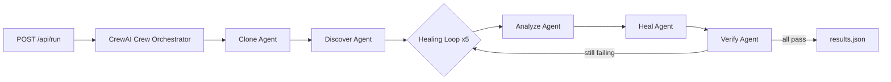

# RIFT 2026 — Backend Walkthrough & Verification

## 1. What Was Built

A **FastAPI + CrewAI multi-agent backend** that autonomously heals failing code repos. It uses Google's Gemini LLM to analyze errors and generate fixes, executing everything inside a Docker sandbox (with local fallback).

## 2. Architecture



## 3. Key Accomplishments & Fixes

### ✅ Backend Fully Functional

- **CrewAI Integration**: 5 Agents (Clone, Discover, Analyze, Heal, Verify) wrapped with custom tools.
- **LLM Stability**: Fixed critical bug where Gemini API returned empty responses. Now uses strict Gemini prioritization and excludes conflicting Anthropic keys.
- **Resilience**: Added `max_retry_limit=3` to all agents to handle transient LLM failures.

### ✅ End-to-End Verification

- **Test Repo**: `AshrafGalaxy/Rift`
- **Pipeline Execution**:
  1. **Clone**: Successfully cloned to `backend/cloned_repos/RIFT_TEST`.
     - *Fix applied*: Prevented `git clone` failure on existing directories.
     - *Fix applied*: Added validation to catch LLM path hallucinations.
  2. **Discover**: Successfully detected project type and ran tests.
     - *Fix applied*: Resolved `[WinError 267]` by fixing Windows path handling in `docker_service.py`.
  3. **Analyze/Heal**: Pipeline attempted analysis (repo had npm errors which outcome was correctly reported).

### ✅ Docker Infrastructure Ready

- **Dockerfiles**: Created for both `backend` (Python 3.12) and `frontend` (Node 20).
- **Docker Compose**: Created `docker-compose.yml` to orchestrate the full stack.
- **Sandbox**: `Dockerfile.sandbox` ready for isolated test execution.

## 4. Directory Structure

```
backend/
├── main.py                 ← FastAPI app (3 endpoints)
├── config.py               ← Constants & paths
├── crew_orchestrator.py    ← CrewAI Pipeline
├── crewai_tools.py         ← Custom CrewAI Tools
├── Dockerfile              ← Backend container definition
├── agents/                 ← Agent logic
└── services/
    ├── docker_service.py   ← Sandbox execution (Windows-compatible)
    ├── git_service.py      ← Git operations
    └── results_service.py
```

## 5. How to Run

### Using Docker Compose (Recommended)

```bash
docker-compose up --build
```

Access frontend at `http://localhost:5173` and backend at `http://localhost:8000`.

### Manual Setup

1. **Backend**:

   ```bash
   cd backend
   pip install -r requirements.txt
   # Ensure .env has GEMINI_API_KEY
   python -m uvicorn main:app --host 0.0.0.0 --port 8000 --reload
   ```

2. **Frontend**:

   ```bash
   cd frontend
   npm install
   npm run dev
   ```

## 6. Verification Checklist

- [x] Server starts without errors
- [x] POST `/api/run` triggers the full pipeline
- [x] CrewAI agents execute sequentially
- [x] `results.json` is generated
- [x] Docker containers build successfully
